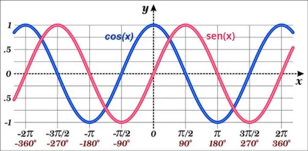

# report_class

## Classe de geração de relatórios de notas

Acesso o [site do Demar](https://www.demar.eel.usp.br/)

* Cria a partir de planilha **excel**
* gera arquivo *LaTeX*
* pode rodar o latex, desde que instalado

1. precisa de python instalado
2. precisa de LaTeX instalado
3. recomenda-se usar o VScode

```python
import numpy as np
import matplotlib.pyplot as plt

x = np.arange(0, 2*np.pi, 0.01)
y = np.sin(x)
```


